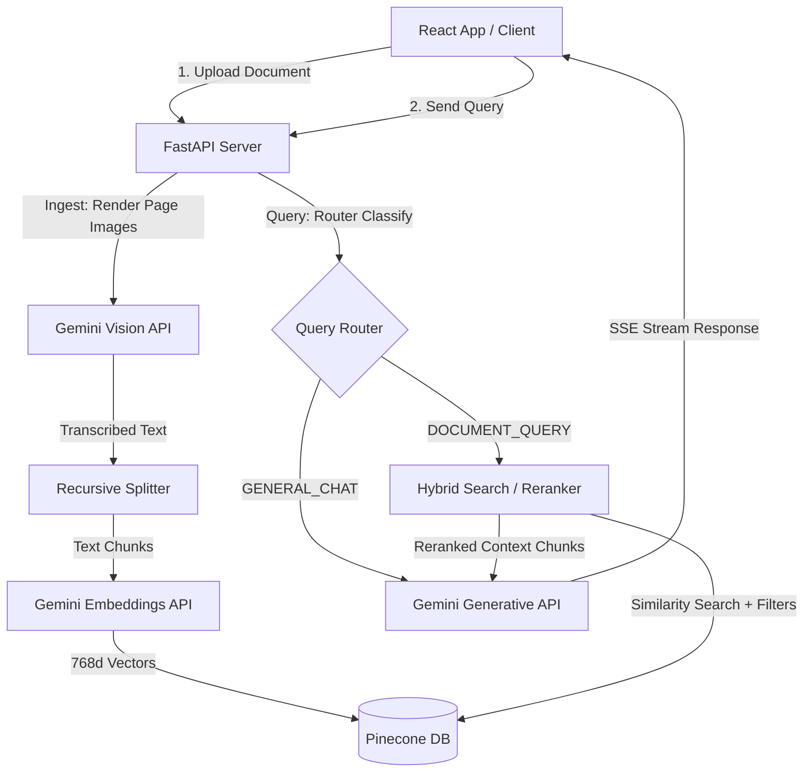
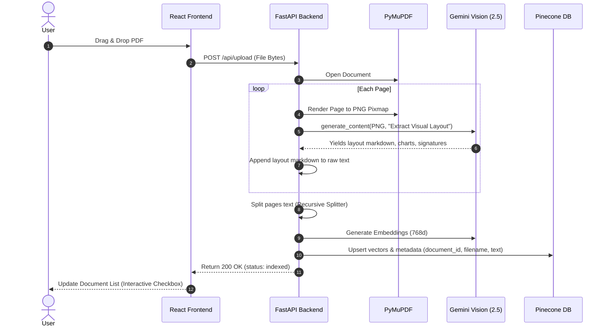
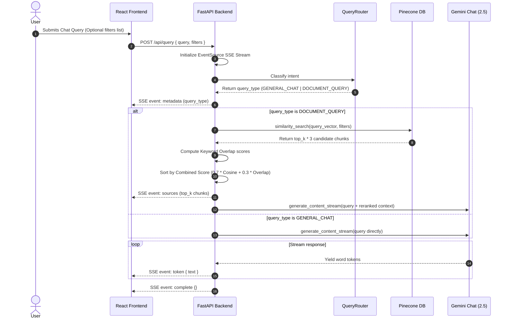

# DocuMind AI Architecture Walkthrough

This document outlines the technical design, data flows, and UI wireframes of the DocuMind AI platform.

---

## 🗺️ System Overview

The core architecture follows a decoupled Micro-RAG layout. The frontend operates as an interactive workspace while the backend FastAPI server processes files, queries Pinecone Serverless indices, and manages Gemini streams.



---

## 📥 Ingestion Pipeline Flow

When a user drops a document (e.g., a PDF) into the workspace sandbox, it flows through these stages:



---

## 💬 Query Routing & Retrieval Pipeline

When a user submits a query:



---

## 🎨 UI Wireframe Layout

The divided modular frontend displays a split-screen dashboard workspace:

```
+----------------------------------------------------------------------------------+
|  [Sparkles] DocuMind AI           [Home]   [Workspace]                 v1.0.0 [] |
+----------------------------------------------------------------------------------+
|  SIDEBAR (320px)       |  CHAT INTERFACE (Flexible Width)  | CITATIONS PANEL (320px) |
|                        |                                   |                         |
|  [ Ingest Document ]   |  Query Session 1                  | [BookMarked] Sources    |
|                        |  Gemini Ingress Connected         |                         |
|  CONVERSATIONS         |  +-----------------------------+  | +---------------------+ |
|  [Msg] Session 1       |  | User: What is Section 4?    |  | | policy_terms.pdf    | |
|  [Msg] Session 2       |  +-----------------------------+  | | Page 2 | 87.5% Match| |
|                        |  | AI: According to Sec 4...   |  | | "Extract snippet"   | |
|  DOCUMENT INDEX        |  +-----------------------------+  | +---------------------+ |
|  Select files to filter|                                   |                         |
|  [x] policy_terms.pdf  |  [ Ask a question...        ] [>] | | policy_guide.docx   | |
|  [ ] guidelines.md     |  [Info] Gemini Agent routes query | | Page 1 | 64.2% Match| |
|                        |                                   | +---------------------+ |
|  [AI] Dev Mode     [S] |                                   |                         |
+----------------------------------------------------------------------------------+
```

*   **Header**: Coordinates views switcher between landing page and workspace.
*   **Sidebar (`components/Sidebar.tsx`)**: Controls PDF document loading upload state, chat sessions, and checkboxes to isolate metadata filters.
*   **Chat Panel (`components/ChatPanel.tsx`)**: Streams conversational turns, displays reasoning classification pathways, and manages inputs.
*   **Citations Panel (`components/CitationsPanel.tsx`)**: Shows active source citations matching the retrieved vectors.
