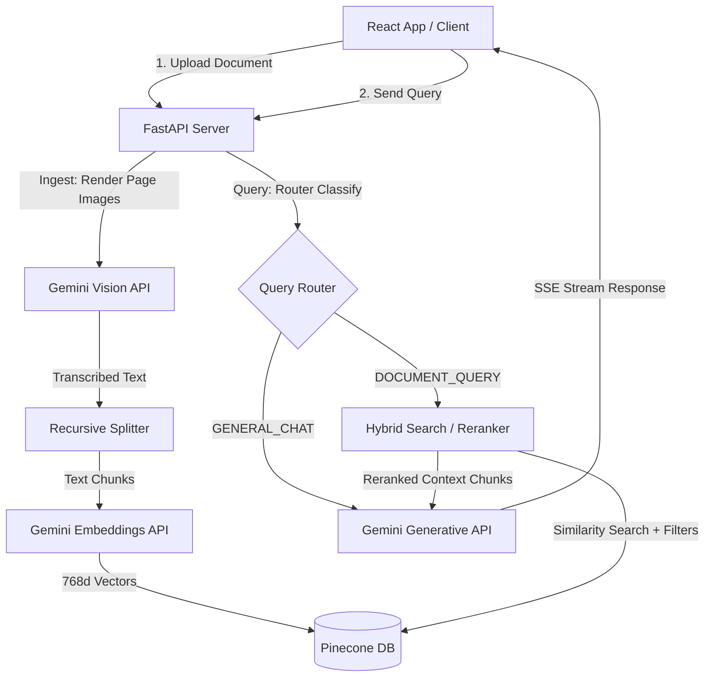
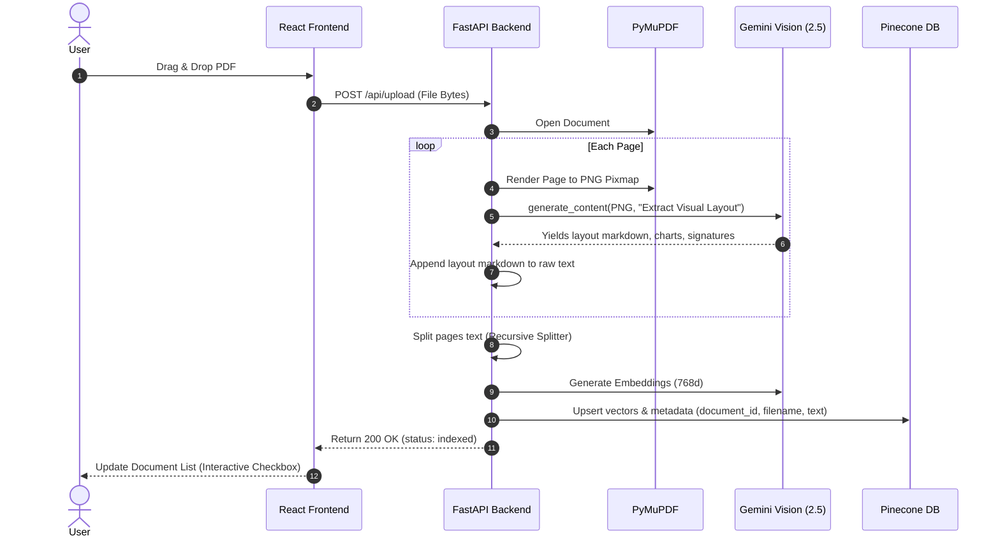
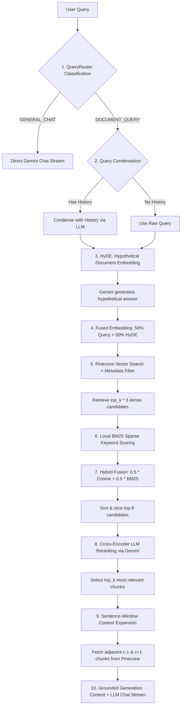
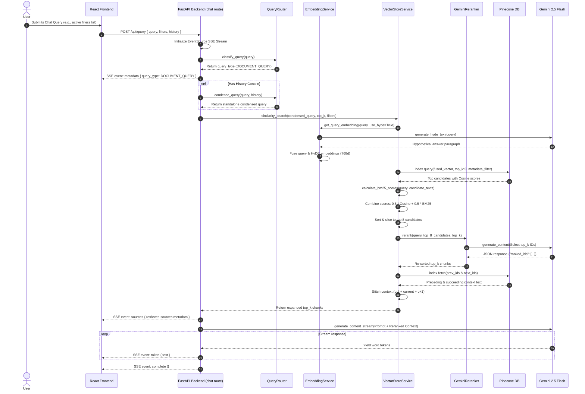
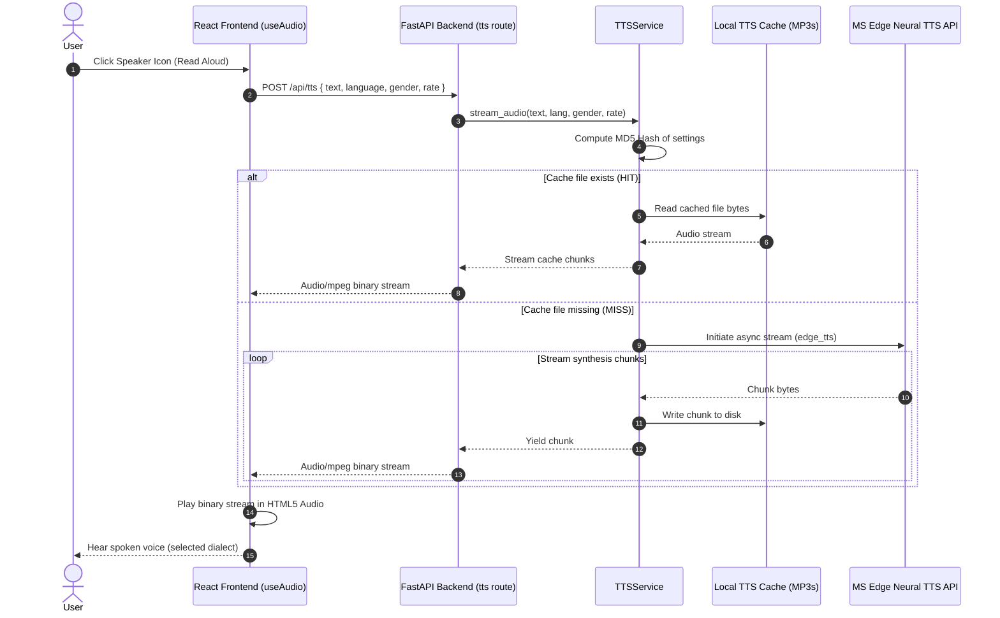
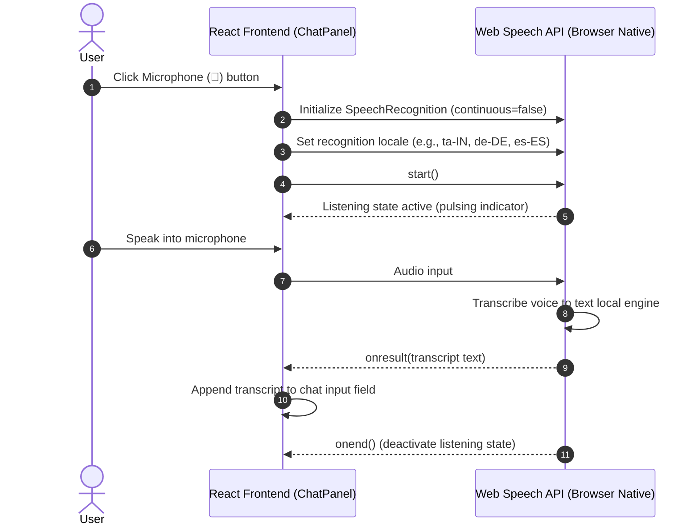

# DocuMind AI Architecture Walkthrough

This document outlines the technical design, data flows, and UI wireframes of the DocuMind AI platform.

---

## 🗺️ System Overview

The core architecture follows a decoupled Micro-RAG layout. The frontend operates as an interactive workspace while the backend FastAPI server processes files, queries Pinecone Serverless indices, and manages Gemini streams.



---

## 📥 Ingestion Pipeline Flow

When a user drops a document (e.g., a PDF) into the workspace sandbox, it flows through these stages:



---

## 💬 Query Routing & Retrieval Pipeline

When a user submits a query, DocuMind AI executes an advanced, multi-stage retrieval pipeline rather than a simple semantic lookup. Below is the technical architecture of the search techniques implemented in the codebase:



### Detailed Sequence Diagram

The interaction sequence between the frontend, backend service singletons, and external APIs during a document query:



---

### 🔍 Search Techniques Breakdown & Implementation

#### 1. Zero-Shot Intent-Based Routing (`router.py`)
Intercepts queries before hitting vector databases to optimize latency and costs. Using `gemini-2.5-flash` with temperature `0.0`, queries are classified into:
*   `DOCUMENT_QUERY`: Triggers RAG pipeline (e.g. *"Summarize section 4 of the guidelines"*).
*   `GENERAL_CHAT`: Direct stream from Gemini, bypassing database lookups entirely (e.g. *"Write a python quicksort function"*).

#### 2. Hypothetical Document Embeddings (HyDE) (`embedding.py`)
To bridge the vocabulary and conceptual gap between queries and target passages, the system uses HyDE query expansion. The model generates a hypothetical paragraph answer to the user's query. Both the raw query and hypothetical paragraph are embedded using `gemini-embedding-001`, and combined element-wise:
$$\vec{E}_{\text{final}} = 0.5 \cdot \vec{E}_{\text{query}} + 0.5 \cdot \vec{E}_{\text{hypothetical}}$$
*This allows the vector database search to match document-to-document representations, significantly improving semantic retrieval accuracy.*

#### 3. Metadata Filtering (`vectorstore.py`)
Limits the search boundary using Pinecone's metadata keys. Checkboxes selected on the UI translate to database-level constraints:
```python
filter = {"filename": {"$in": selected_filenames}}
```
*This allows multi-document isolation, ensuring users search only the files they explicitly select.*

#### 4. Dense-Sparse Hybrid Search (`vectorstore.py`)
Vector databases excel at capturing semantic synonyms but struggle with exact keywords, codes, or formulas. We resolve this by calculating local BM25 keyword matching scores for the dense candidates, and performing Reciprocal Rank/Score Fusion:
$$\text{Score}_{\text{hybrid}} = 0.5 \cdot \text{Score}_{\text{CosineSimilarity}} + 0.5 \cdot \text{Score}_{\text{BM25Normalized}}$$
*Dense search retrieves top candidates conceptually, and sparse BM25 scores highlight the ones matching the exact keywords.*

#### 5. Cross-Encoder LLM Reranking (`reranker.py`)
Rather than relying solely on mathematical vector distance calculations, candidate chunks are evaluated contextually. The top 8 candidates are presented to `gemini-2.5-flash` as a Cross-Encoder Reranker, which selects the top `top_k` chunks that directly address the user's query intent.
*This filters out false-positive vector matches and places the most relevant details at the beginning of the context block.*

#### 6. Sentence-Window Context Expansion (`vectorstore.py`)
To keep vector retrieval highly specific but generation context-rich, documents are chunked into small semantic units (750 chars). During retrieval, once a chunk is selected, the backend extracts the preceding and succeeding chunk IDs using the structured index schema:
$$\text{IDs} = [id_{\text{chunk} - 1}, id_{\text{chunk}}, id_{\text{chunk} + 1}]$$
It fetches these surrounding paragraphs in a single batch call to Pinecone, stitching the texts together before feeding them to Gemini.
*This solves the core RAG dilemma: retrieving precise segments for embedding matching while providing broad context for LLM comprehension.*


---

## 🔊 Multilingual Text-to-Speech (TTS) Pipeline

When a user clicks "Read Aloud" on any assistant response:



---

## 🎤 Speech-to-Text (STT) Voice Input Flow

When a user clicks the Microphone button to dictate their query:



---

## 🎨 UI Wireframe Layout

The divided modular frontend displays a split-screen dashboard workspace:

```
+----------------------------------------------------------------------------------+
|  [Sparkles] DocuMind AI           [Home]   [Workspace]                 v1.0.0 [] |
+----------------------------------------------------------------------------------+
|  SIDEBAR (320px)       |  CHAT INTERFACE (Flexible Width)  | CITATIONS PANEL (320px) |
|                        |                                   |                         |
|  [ Ingest Document ]   |  Query Session 1                  | [BookMarked] Sources    |
|                        |  Gemini Ingress Connected         |                         |
|  CONVERSATIONS         |  +-----------------------------+  | +---------------------+ |
|  [Msg] Session 1       |  | User: What is Section 4?    |  | | policy_terms.pdf    | |
|  [Msg] Session 2       |  +-----------------------------+  | | Page 2 | 87.5% Match| |
|                        |  | AI: According to Sec 4...   |  | | "Extract snippet"   | |
|  DOCUMENT INDEX        |  +-----------------------------+  | +---------------------+ |
|  Select files to filter|                                   |                         |
|  [x] policy_terms.pdf  |  [ Ask a question...        ] [>] | | policy_guide.docx   | |
|  [ ] guidelines.md     |  [Info] Gemini Agent routes query | | Page 1 | 64.2% Match| |
|                        |                                   | +---------------------+ |
|  [AI] Dev Mode     [S] |                                   |                         |
+----------------------------------------------------------------------------------+
```

*   **Header**: Coordinates views switcher between landing page and workspace.
*   **Sidebar (`components/Sidebar.tsx`)**: Controls PDF document loading upload state, chat sessions, and checkboxes to isolate metadata filters.
*   **Chat Panel (`components/ChatPanel.tsx`)**: Streams conversational turns, displays reasoning classification pathways, manages inputs, and integrates audio player components.
*   **Voice Controller (`components/VoiceController.tsx`)**: Floating menu dropdown managing speech options (TTS voice dialect, gender, rate, and STT locale).
*   **Citations Panel (`components/CitationsPanel.tsx`)**: Shows active source citations matching the retrieved vectors.
